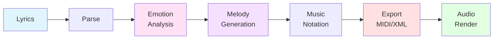

```mermaid
graph LR
    A[Lyrics] --> B[Parse]
    B --> C[Emotion<br/>Analysis]
    C --> D[Melody<br/>Generation]
    D --> E[Music<br/>Notation]
    E --> F[Export<br/>MIDI/XML]
    F --> G[Audio<br/>Render]
    
    style A fill:#e1f5ff
    style C fill:#ffe1f5
    style D fill:#f5e1ff
    style F fill:#ffe1e1
    style G fill:#e1ffe1
```
